# 02 · User Flows

Phase 1 · Design | Status: awaiting sign-off

Diagrams are Mermaid; they render in GitHub, VS Code, and most Markdown viewers.

---

## 1. Buyer · First purchase (the flow that decides whether this product works)

The single most important journey. Every step where a first-time buyer could reasonably abandon is
marked ⚠ with its mitigation.

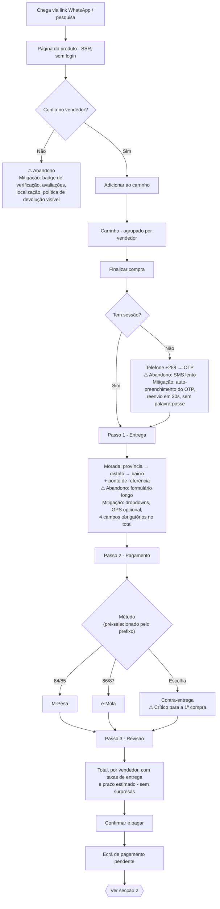

**Total required input for a first purchase: phone number, OTP, four address fields.** No password,
no email, no card. That number is the design target and every added field must be defended.

## 2. Payment · The asynchronous push flow

This is the highest-risk flow in the product. Mobile-money push payments are asynchronous over an
unreliable channel: the callback can arrive late, twice, out of order, or never — while the user's
handset may already show success.

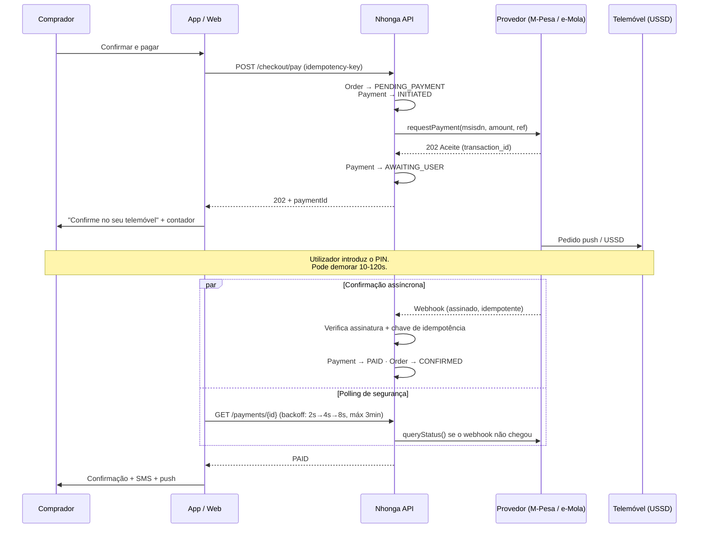

### Payment state machine (D-14)

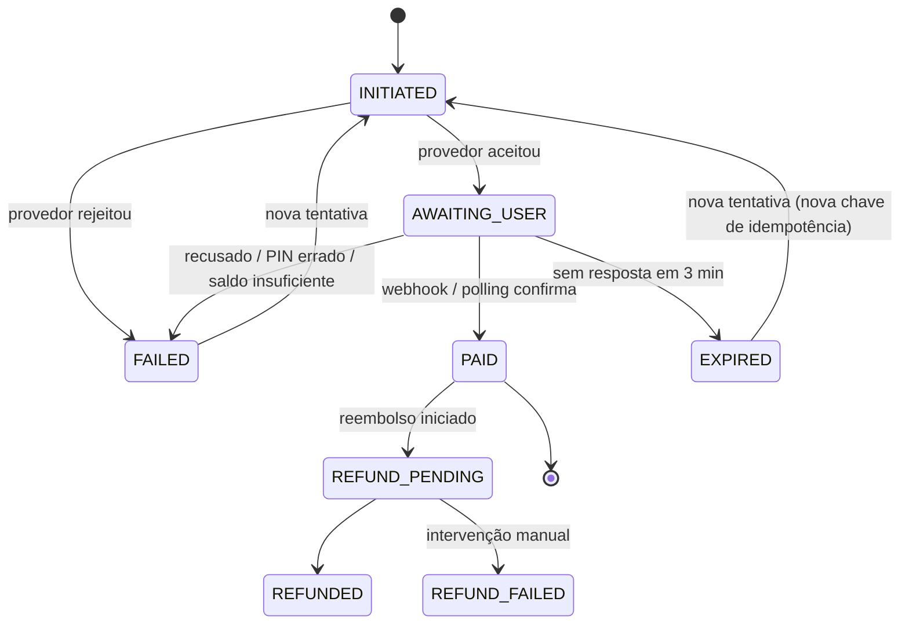

**The four rules this state machine exists to enforce:**

1. **Every transition is idempotent.** A webhook delivered three times produces one state change.
2. **`EXPIRED` is not `FAILED`.** The user may yet approve on the handset. Expiry closes the UI
   wait, but reconciliation continues server-side — and if a late approval lands, the order is
   honoured rather than the money being lost in limbo.
3. **The client never determines payment state.** It displays what the server says. A user with a
   confirmation SMS from Vodacom and a "pending" screen is a support ticket; a user whose client
   decided it was paid when it was not is a financial loss.
4. **Retry always issues a new idempotency key** for a new attempt, so a retry cannot be collapsed
   into the prior one — while a _duplicate_ of the same attempt still is.

### When the user disappears mid-payment

Closing the app, losing signal, or a dying battery must all be survivable:

- Payment state lives on the server; the client reconciles on next launch.
- A pending payment surfaces as a persistent banner on Home until it resolves.
- SMS is sent on resolution regardless of app state — the notification of last resort.
- A reconciliation job sweeps `AWAITING_USER` payments older than 3 minutes and queries the
  provider directly, so resolution never depends on the user returning.

## 3. Buyer · Order tracking and completion

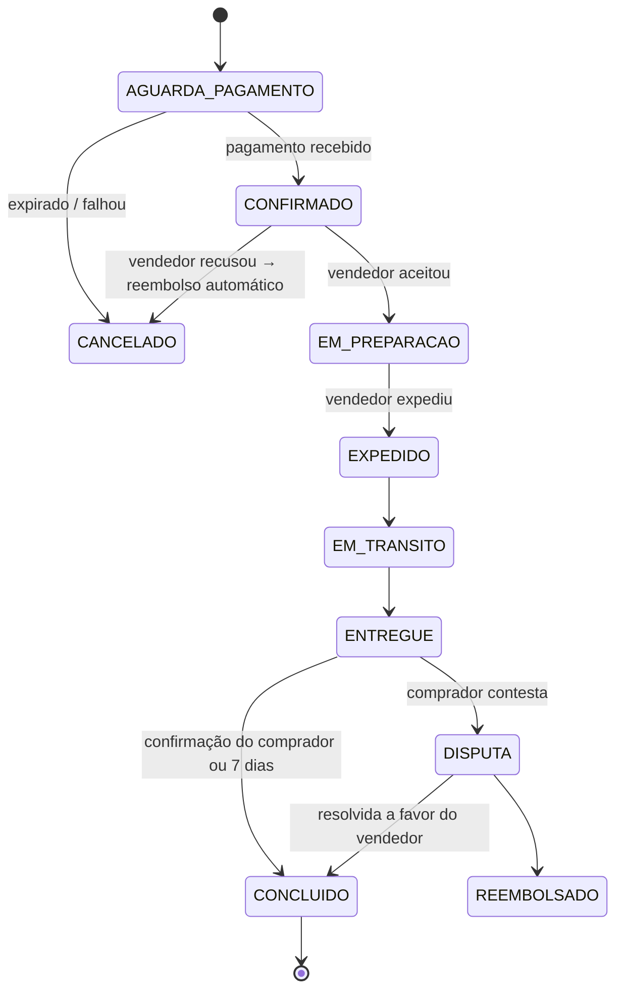

State transitions live at the **`SubOrder`** level, so a two-vendor order genuinely shows two
independent timelines. Attempting to collapse this into a single order status produces immediate
nonsense ("shipped" when half the order has not been).

**Notification policy** — each event fires push where available, with SMS fallback for the four
events that materially affect the buyer's money or plans:

| Event                | Push | SMS | Why SMS                                         |
| -------------------- | ---- | --- | ----------------------------------------------- |
| Pagamento confirmado | ✓    | ✓   | Money left their wallet; they need proof        |
| Vendedor aceitou     | ✓    | —   |                                                 |
| Expedido             | ✓    | ✓   | They may need to be present                     |
| Entregue             | ✓    | ✓   | Starts the 7-day dispute window                 |
| Disputa atualizada   | ✓    | ✓   | Money at stake                                  |
| Promoções            | ✓    | —   | Never SMS. Marketing SMS burns trust and money. |

SMS costs real money per message, so this table is a budget decision as much as a UX one.

**Auto-completion after 7 days** protects vendors from buyers who never confirm, which is the
common failure mode and would otherwise strand settlements indefinitely. The window is
admin-configurable.

## 4. Buyer · Review

Reviews are only possible from a **delivered `OrderItem`** (IA §8). Entry points: the post-delivery
notification, the order detail screen, and a persistent prompt in Orders.

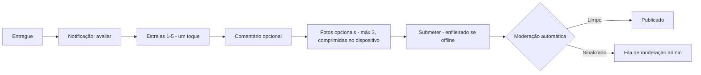

The rating is one tap and everything after it is optional — this is deliberate. Review coverage,
not review depth, is what makes a marketplace navigable early on, and every required field cuts
completion sharply. Images are compressed on-device before upload (D-09).

## 5. Buyer · Dispute

Discoverable from the PDP _before_ purchase ("Proteção ao comprador"), not only afterwards.

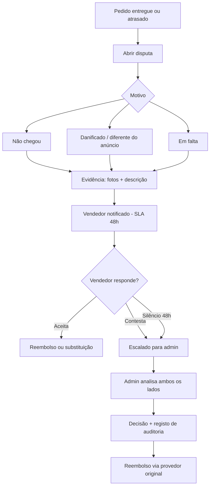

**Settlement hold:** funds for a disputed `SubOrder` are held and excluded from the vendor's next
payout until resolution. This is why `Settlement` is modelled per `SubOrder` (D-11) — a
platform-wide payout batch cannot selectively withhold one contested item.

## 6. Vendor · Onboarding and KYC

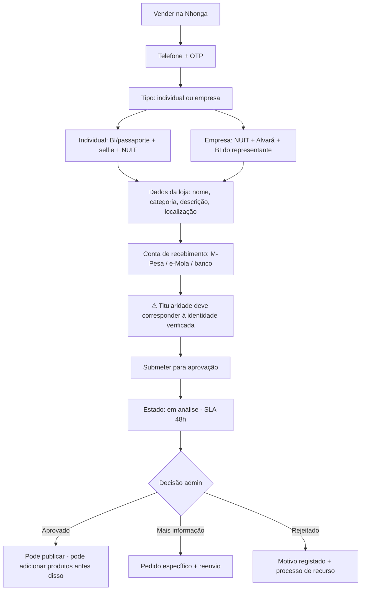

Two decisions that matter for supply acquisition:

- **Vendors can add products while KYC is pending**, but cannot publish. Onboarding drop-off is the
  main risk to supply, and dead waiting time is where it happens. Letting someone build their
  catalogue during the wait converts the wait into investment.
- **Payout account holder must match verified identity.** Mismatch is the single clearest fraud
  signal in marketplace payouts and the cheapest one to check.

Document capture is camera-first with on-device compression and an explicit legibility check —
Nélia is photographing her ID on a phone, and a rejected-for-blurriness loop is a classic
onboarding killer.

## 7. Vendor · Add a product (phone-optimised)

Four steps, each one screen, saved as draft after every step so a dropped connection never loses
work.

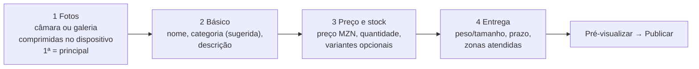

Photos come **first**, before the form. A phone-based seller has the product in front of them and
the photo is the part they are motivated to do; leading with the camera and following with typing
gets more listings finished than the conventional form-first order. Category is suggested from the
product name to avoid a three-level drill-down on a phone.

**Bulk upload** (Loja Cristal persona): CSV with a downloadable template, validated row-by-row with
errors reported per row rather than as a single failure, plus a ZIP of images matched by SKU.

## 8. Vendor · Order fulfilment

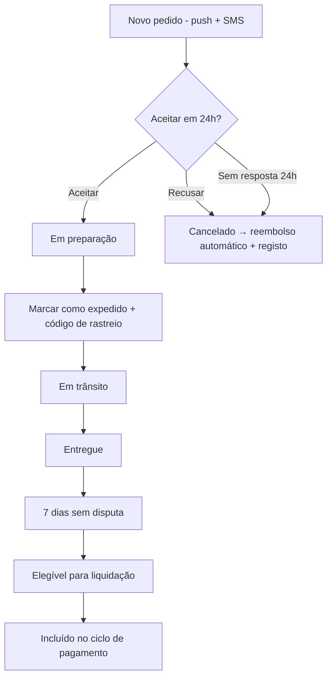

Repeated non-response degrades a vendor's ranking and, past a threshold, triggers admin review.
Auto-cancel exists because an unanswered order is worse for buyer trust than a declined one.

## 9. Vendor · Settlement

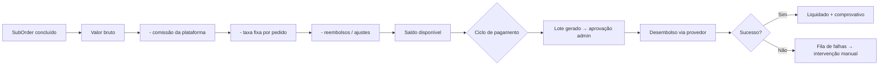

Every deduction is itemised per order in the vendor's finance view. Opaque deductions are the
fastest way to lose vendors, and the transparency costs nothing to build if designed in now.
Settlement cadence and disbursement rail depend on OQ-4 and OQ-7/8.

## 10. Admin · Vendor approval

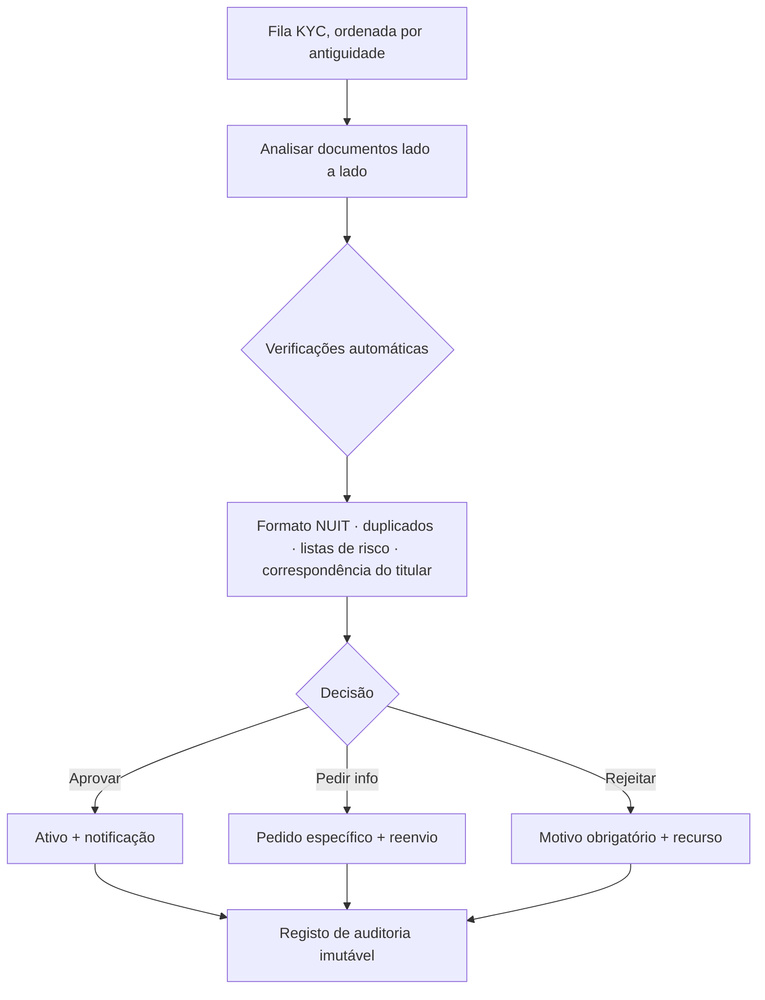

A rejection reason is mandatory — not bureaucracy, but the thing that makes the appeal process and
any future regulatory question answerable.

## 11. Cross-cutting · Authentication (OTP)

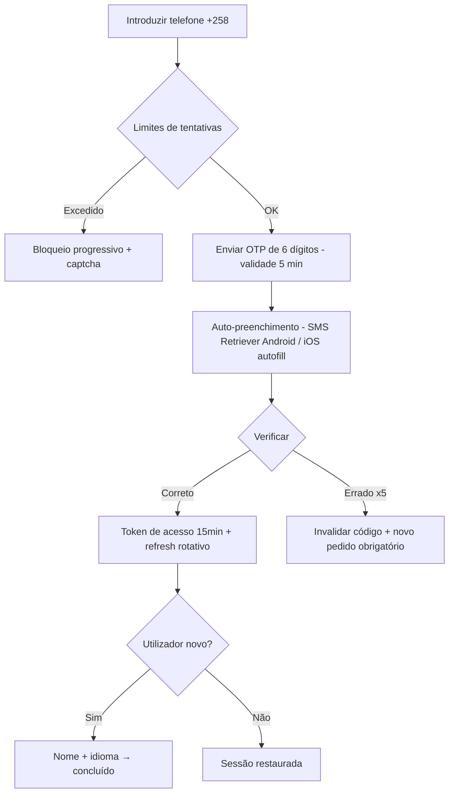

The abuse surface is treated as security-critical from Phase 1 (D-04): per-number, per-IP and
per-device rate limits, a global send-rate circuit breaker, progressive lockout, single-use codes
invalidated on success or on five failures, and a hard daily SMS spend cap. Every SMS costs money,
so an unprotected OTP endpoint is both a security hole and a direct financial drain.

---

**Next:** [03 · Design System](03-design-system.md)
