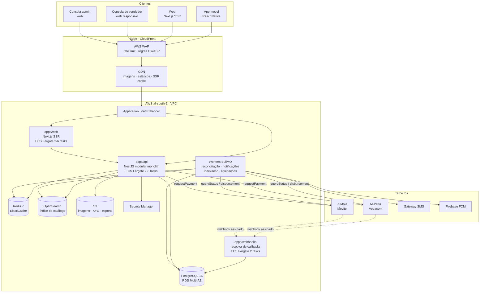
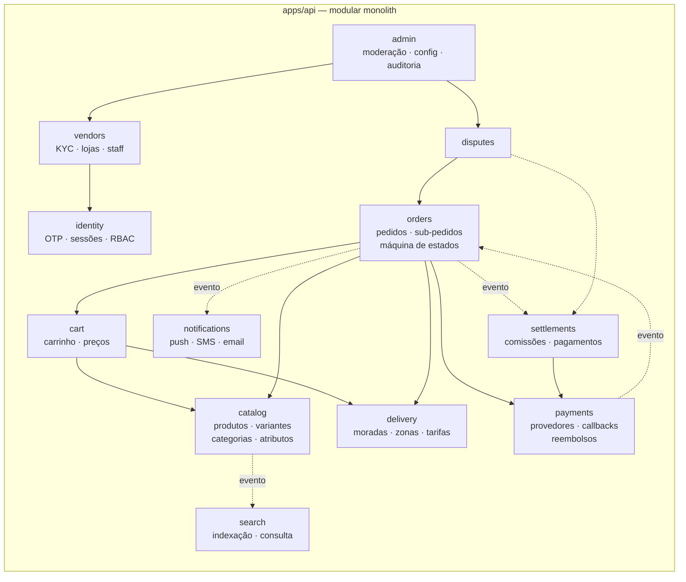
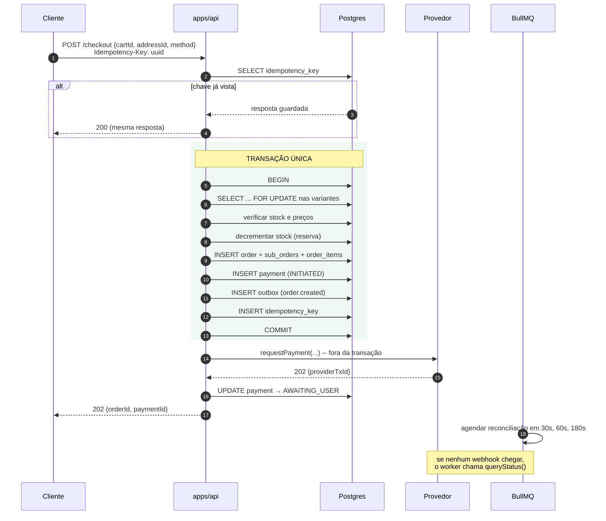
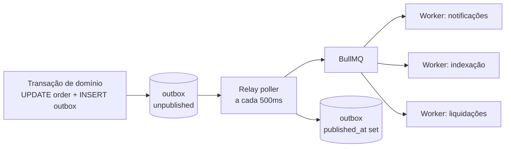
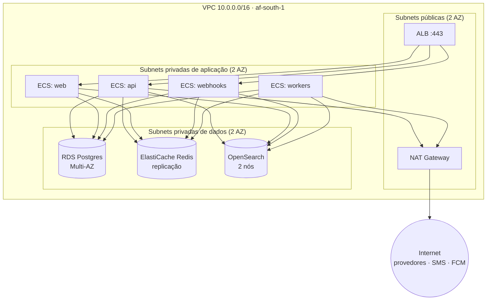

# 01 · System Architecture

Phase 2 · Architecture | Status: awaiting sign-off

---

## 1. System context

**The webhook receiver is deliberately isolated.** Provider callbacks are the only inbound path we
do not control the timing of, and a callback we fail to accept may be a payment we never learn
about. It deploys separately, scales separately, and does almost nothing — verify signature, persist
the raw event, return 200. All interpretation happens asynchronously in a worker.

## 2. Module map

Solid arrows are synchronous calls through a module's public service interface. Dotted arrows are
domain events delivered through the transactional outbox.

**Dependency rules, enforced in CI** by dependency-cruiser:

1. No module imports another module's `*.repository.ts` or entity files — only its
   `*.service.ts` public interface.
2. No cyclic dependencies between modules. Where two modules would need each other, the lower one
   emits an event instead (this is why `payments → orders` is an event, not a call).
3. `notifications`, `search`, and `settlements` are leaf consumers: nothing calls into them
   synchronously from the request path.

## 3. Request path: placing an order

The most important sequence in the system. Note precisely where the database transaction begins and
ends.

Three points that matter:

- **The provider call happens outside the transaction.** Holding a Postgres transaction open across
  a network call to Vodacom would pin row locks for the duration of an unpredictable external
  request — the classic way to take down a database under load.
- **Stock is decremented at order creation, not at payment confirmation.** Reserving on creation can
  strand stock if payment fails; reserving on confirmation oversells. Overselling is worse: it
  breaks a promise already made to a buyer. Stranded stock is released by a worker when the payment
  reaches `FAILED` or `EXPIRED`.
- **Reconciliation is scheduled immediately**, at order-creation time. It does not depend on the
  webhook arriving, on the client staying connected, or on the user returning to the app.

## 4. The transactional outbox

Domain events are written to an `outbox` table **inside the same transaction as the state change**,
then relayed to BullMQ by a poller.

Publishing directly to Redis from inside a transaction produces the two classic bugs: an event
published for a transaction that then rolls back (a notification for an order that does not exist),
or a committed transaction whose event was lost when the process died. The outbox makes event
publication exactly as durable as the state change it describes.

Consumers are **idempotent** and events carry a monotonic `sequence` per aggregate, because at-least
once delivery means a notification worker will occasionally see the same event twice.

## 5. Caching strategy

Directly serves the data-cost constraint (D-09). Four layers:

| Layer                | Contents                                                                   | TTL                                            | Invalidation                              |
| -------------------- | -------------------------------------------------------------------------- | ---------------------------------------------- | ----------------------------------------- |
| **Client (RN / SW)** | Catalogue pages, product details, order list                               | 7 days, stale-while-revalidate                 | ETag revalidation                         |
| **CloudFront**       | Images, static assets, SSR catalogue HTML                                  | Images 1 year (content-hashed); HTML 60s + SWR | On-demand invalidation on product publish |
| **Redis**            | Product detail read models, category trees, vendor profiles, homepage feed | 5–60 min                                       | Event-driven purge from the outbox        |
| **Postgres**         | Source of truth                                                            | —                                              | —                                         |

**Never cached:** cart contents, checkout, payment status, order status transitions, anything under
`/admin` or `/vendor`. Serving a stale payment status is exactly the failure that loses money.

Cache keys include the locale, so the PT and EN variants never cross-contaminate.

## 6. Deployment topology

- Data subnets have **no route to the internet** in either direction. Security groups permit only
  the application security group on the specific port.
- Outbound calls to payment providers egress through the NAT gateway, which gives a **stable source
  IP** — several providers require IP allowlisting, so this is a functional requirement, not just
  hygiene.
- The webhook service accepts inbound traffic only from provider source ranges, enforced at the WAF
  and again in application middleware.

## 7. Scaling profile

Sized against A-10 (≈1,000 orders/day at launch) with headroom, and against the actual shape of
the load — which is spiky around paydays and holidays, not uniform.

| Service    | Baseline        | Max           | Trigger                                                         |
| ---------- | --------------- | ------------- | --------------------------------------------------------------- |
| `api`      | 2 tasks         | 8             | CPU > 65% or p95 latency > 400ms                                |
| `web`      | 2               | 6             | CPU > 65%                                                       |
| `webhooks` | 2               | 4             | Request count — kept generous; dropping a callback is expensive |
| `workers`  | 2               | 6             | Queue depth > 500                                               |
| RDS        | `db.t4g.medium` | → `m7g.large` | Vertical first; read replica when read load justifies it        |

**First bottleneck we expect:** the `SELECT ... FOR UPDATE` on product variants during checkout, if
a single popular SKU is bought concurrently. Mitigation is ordered lock acquisition by variant ID to
prevent deadlocks, plus a short lock timeout that surfaces as a clean "tente novamente" rather than
a hung request.

## 8. Observability

| Concern         | Tool                                                                     | Note                                                                |
| --------------- | ------------------------------------------------------------------------ | ------------------------------------------------------------------- |
| Structured logs | Pino JSON → CloudWatch                                                   | Every log carries `requestId`, `userId`, `orderId` where applicable |
| Tracing         | OpenTelemetry → AWS X-Ray                                                | Provider calls and DB queries spanned separately                    |
| Errors          | Sentry                                                                   | Web, mobile, and API, with release tracking                         |
| Metrics         | CloudWatch + a Grafana dashboard                                         |                                                                     |
| Uptime          | Health checks on `/health` (liveness) and `/health/ready` (dependencies) |                                                                     |

**Business alarms that page someone**, distinct from infrastructure alarms:

- Payment success rate below 85% over 15 minutes — the leading indicator that a provider is down
- Any payment in `AWAITING_USER` for more than 15 minutes
- Outbox backlog above 1,000 unpublished rows
- Reconciliation job failure
- Settlement batch failure
- OTP send rate above the daily budget's hourly pro-rata — catches abuse and runaway cost together

**Financial logs are never sampled and are retained for seven years.** Sampling a payment log means
being unable to answer where a specific person's money went.

## 9. Failure modes and degradation

Designed behaviour when each dependency fails, rather than whatever happens by default:

| Failure                   | Behaviour                                                                                                                                                               |
| ------------------------- | ----------------------------------------------------------------------------------------------------------------------------------------------------------------------- |
| OpenSearch down           | Search degrades to Postgres category listings; a banner says search is limited. Browsing continues.                                                                     |
| Redis down                | Cache misses fall through to Postgres. **OTP and rate limiting fail closed** — login is refused rather than left unprotected.                                           |
| One payment provider down | Marked unavailable at checkout; buyers are routed to the other wallet or COD. Circuit breaker opens after 5 consecutive failures, half-open retry after 60s.            |
| Both providers down       | COD only, stated plainly on the payment step.                                                                                                                           |
| SMS gateway down          | Push still delivers; SMS queues with a 24h TTL. **OTP login is blocked** and says so — it cannot silently half-work.                                                    |
| Postgres primary fails    | Multi-AZ failover, ~60–120s. API returns 503 with `Retry-After`; clients back off.                                                                                      |
| Webhook receiver down     | Providers retry on their own schedule; our reconciliation workers close the gap via `queryStatus()` regardless. This is why reconciliation does not depend on webhooks. |

---

**Next:** [02 · Data Model](02-data-model.md)
