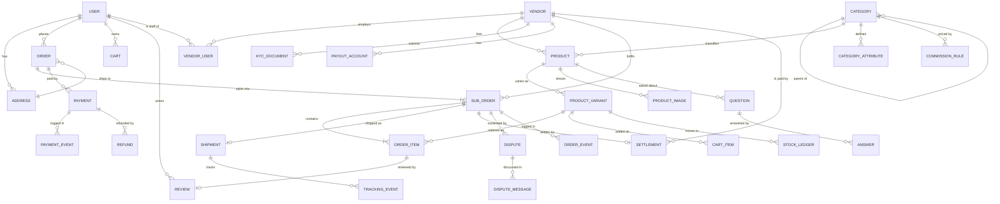

# 02 · Data Model

Phase 2 · Architecture | Status: awaiting sign-off

PostgreSQL 16. All money is `BIGINT` centavos. All timestamps are `TIMESTAMPTZ` stored UTC. All
primary keys are UUIDv7 — time-ordered, so they index well without leaking a sequential count of our
order volume to anyone who places an order.

---

## 1. Entity-relationship overview



## 2. The three structural decisions

### 2.1 `order` / `sub_order` (D-11)

```
order         = the buyer's unit.  One payment, one delivery address, one total.
sub_order     = the vendor's unit. One fulfilment lifecycle, one shipping fee,
                one settlement, one review target, one dispute scope.
```

**Order status is derived, never stored.** There is no `order.status` column, because a
two-vendor order has no single truthful status — one half can be delivered while the other is still
being packed. The API computes a rollup for display (`parcialmente entregue`), but every state
transition happens on `sub_order`. Storing a denormalised order status would guarantee it drifts out
of sync with its children, and that drift shows up as a lie in the buyer's order timeline.

### 2.2 `payment_event` is append-only

Every provider interaction — our request, their acknowledgement, each webhook delivery, each status
query — is a row. Nothing is updated, nothing is deleted. `payment.status` is a projection of this
log, and the log is what we can point at when a buyer says they were debited.

The unique constraint on `(provider, provider_event_id)` is what makes duplicate webhook delivery a
non-event: the second insert violates the constraint, we return 200, and no state changes.

### 2.3 `stock_ledger` instead of a mutable counter

`product_variant.stock_quantity` exists as a fast denormalised read, but every change writes a
`stock_ledger` row with a reason and a reference. When stock is wrong — and eventually it will be —
the ledger is how we find out why. A bare counter that drifts is unauditable, and the vendor will
ask.

## 3. Core tables

### identity

```sql
CREATE TABLE app_user (
  id                UUID PRIMARY KEY,
  phone_e164        TEXT NOT NULL UNIQUE,          -- +258841234567
  phone_verified_at TIMESTAMPTZ,
  email             CITEXT UNIQUE,                 -- optional (D-04)
  email_verified_at TIMESTAMPTZ,
  display_name      TEXT NOT NULL,
  locale            TEXT NOT NULL DEFAULT 'pt-MZ'
                      CHECK (locale IN ('pt-MZ','en')),
  status            TEXT NOT NULL DEFAULT 'active'
                      CHECK (status IN ('active','suspended','deleted')),
  created_at        TIMESTAMPTZ NOT NULL DEFAULT now(),
  updated_at        TIMESTAMPTZ NOT NULL DEFAULT now(),
  deleted_at        TIMESTAMPTZ                    -- soft delete; see §7
);
CREATE INDEX ON app_user (phone_e164) WHERE deleted_at IS NULL;

CREATE TABLE otp_challenge (
  id            UUID PRIMARY KEY,
  phone_e164    TEXT NOT NULL,
  code_hash     TEXT NOT NULL,                     -- Argon2id. NEVER the plaintext code
  purpose       TEXT NOT NULL CHECK (purpose IN ('login','verify_phone','payout_change')),
  attempts      SMALLINT NOT NULL DEFAULT 0,
  max_attempts  SMALLINT NOT NULL DEFAULT 5,
  expires_at    TIMESTAMPTZ NOT NULL,
  consumed_at   TIMESTAMPTZ,
  created_ip    INET,
  created_at    TIMESTAMPTZ NOT NULL DEFAULT now()
);
CREATE INDEX ON otp_challenge (phone_e164, created_at DESC);

CREATE TABLE refresh_token (
  id           UUID PRIMARY KEY,
  user_id      UUID NOT NULL REFERENCES app_user(id) ON DELETE CASCADE,
  token_hash   TEXT NOT NULL UNIQUE,               -- SHA-256; never the raw token
  family_id    UUID NOT NULL,                      -- rotation family, for reuse detection
  device_label TEXT,
  expires_at   TIMESTAMPTZ NOT NULL,
  revoked_at   TIMESTAMPTZ,
  created_at   TIMESTAMPTZ NOT NULL DEFAULT now()
);
```

`family_id` implements refresh-token reuse detection: presenting an already-rotated token revokes
the entire family, because the only reason to present an old token is that it was stolen.

### catalog

```sql
CREATE TABLE category (
  id          UUID PRIMARY KEY,
  parent_id   UUID REFERENCES category(id),
  slug        TEXT NOT NULL UNIQUE,
  name_pt     TEXT NOT NULL,
  name_en     TEXT NOT NULL,
  level       SMALLINT NOT NULL CHECK (level BETWEEN 1 AND 3),   -- max 3 (IA §6)
  sort_order  INT NOT NULL DEFAULT 0,
  is_active   BOOLEAN NOT NULL DEFAULT TRUE
);

CREATE TABLE product (
  id             UUID PRIMARY KEY,
  vendor_id      UUID NOT NULL REFERENCES vendor(id),
  category_id    UUID NOT NULL REFERENCES category(id),
  slug           TEXT NOT NULL UNIQUE,
  title_pt       TEXT NOT NULL,
  title_en       TEXT,
  description_pt TEXT,
  description_en TEXT,
  attributes     JSONB NOT NULL DEFAULT '{}',   -- typed against category_attribute
  status         TEXT NOT NULL DEFAULT 'draft'
                   CHECK (status IN ('draft','pending_review','active','suspended','archived')),
  weight_grams   INT CHECK (weight_grams > 0),
  rating_avg     NUMERIC(2,1),                  -- denormalised from review
  rating_count   INT NOT NULL DEFAULT 0,
  published_at   TIMESTAMPTZ,
  created_at     TIMESTAMPTZ NOT NULL DEFAULT now(),
  updated_at     TIMESTAMPTZ NOT NULL DEFAULT now()
);
CREATE INDEX ON product (vendor_id, status);
CREATE INDEX ON product (category_id) WHERE status = 'active';
CREATE INDEX ON product USING GIN (attributes);

CREATE TABLE product_variant (
  id              UUID PRIMARY KEY,
  product_id      UUID NOT NULL REFERENCES product(id) ON DELETE CASCADE,
  sku             TEXT NOT NULL,
  options         JSONB NOT NULL,                -- {"cor":"Preto","tamanho":"M"}
  price_cents     BIGINT NOT NULL CHECK (price_cents >= 0),
  compare_at_cents BIGINT CHECK (compare_at_cents >= 0),
  stock_quantity  INT NOT NULL DEFAULT 0 CHECK (stock_quantity >= 0),   -- DB-enforced
  is_active       BOOLEAN NOT NULL DEFAULT TRUE,
  UNIQUE (product_id, sku)
);

CREATE TABLE stock_ledger (
  id           UUID PRIMARY KEY,
  variant_id   UUID NOT NULL REFERENCES product_variant(id),
  delta        INT NOT NULL,
  reason       TEXT NOT NULL CHECK (reason IN
                 ('vendor_adjust','order_reserve','order_release','order_cancel',
                  'return','recount','import')),
  reference_id UUID,                              -- order/sub_order that caused it
  actor_id     UUID,
  created_at   TIMESTAMPTZ NOT NULL DEFAULT now()
);
CREATE INDEX ON stock_ledger (variant_id, created_at DESC);
```

`CHECK (stock_quantity >= 0)` is the point of the design. Overselling becomes a transaction that
*cannot commit*, rather than a race the application is trusted to avoid.

### orders

```sql
CREATE TABLE "order" (
  id                 UUID PRIMARY KEY,
  order_number       TEXT NOT NULL UNIQUE,         -- human-facing: #4821
  user_id            UUID NOT NULL REFERENCES app_user(id),
  address_snapshot   JSONB NOT NULL,               -- frozen copy, see §4
  items_total_cents    BIGINT NOT NULL CHECK (items_total_cents >= 0),
  shipping_total_cents BIGINT NOT NULL CHECK (shipping_total_cents >= 0),
  payment_fee_cents    BIGINT NOT NULL DEFAULT 0,  -- OQ-5 lives here
  discount_cents       BIGINT NOT NULL DEFAULT 0,
  grand_total_cents    BIGINT NOT NULL CHECK (grand_total_cents >= 0),
  currency           CHAR(3) NOT NULL DEFAULT 'MZN',
  placed_at          TIMESTAMPTZ NOT NULL DEFAULT now(),
  CONSTRAINT totals_balance CHECK (
    grand_total_cents =
      items_total_cents + shipping_total_cents + payment_fee_cents - discount_cents
  )
);
```

`totals_balance` is a deliberate belt-and-braces constraint: an order whose arithmetic does not add
up cannot be written, whatever a bug in the pricing code does.

```sql
CREATE TABLE sub_order (
  id                 UUID PRIMARY KEY,
  order_id           UUID NOT NULL REFERENCES "order"(id),
  vendor_id          UUID NOT NULL REFERENCES vendor(id),
  sub_order_number   TEXT NOT NULL UNIQUE,         -- #4821-A
  status             TEXT NOT NULL DEFAULT 'awaiting_payment' CHECK (status IN (
                       'awaiting_payment','confirmed','preparing','shipped',
                       'in_transit','delivered','completed','cancelled','disputed','refunded')),
  items_total_cents    BIGINT NOT NULL,
  shipping_cents       BIGINT NOT NULL,
  commission_cents     BIGINT NOT NULL DEFAULT 0,
  platform_fee_cents   BIGINT NOT NULL DEFAULT 0,
  vendor_net_cents     BIGINT NOT NULL DEFAULT 0,
  delivery_method    TEXT NOT NULL CHECK (delivery_method IN ('marketplace','vendor','pickup')),
  accepted_at        TIMESTAMPTZ,
  shipped_at         TIMESTAMPTZ,
  delivered_at       TIMESTAMPTZ,
  completed_at       TIMESTAMPTZ,
  auto_complete_at   TIMESTAMPTZ,                  -- delivered_at + 7 days
  UNIQUE (order_id, vendor_id)
);
CREATE INDEX ON sub_order (vendor_id, status);
CREATE INDEX ON sub_order (status, auto_complete_at) WHERE status = 'delivered';

CREATE TABLE order_item (
  id                 UUID PRIMARY KEY,
  sub_order_id       UUID NOT NULL REFERENCES sub_order(id),
  variant_id         UUID NOT NULL REFERENCES product_variant(id),
  product_snapshot   JSONB NOT NULL,               -- title, image, options at purchase time
  unit_price_cents   BIGINT NOT NULL CHECK (unit_price_cents >= 0),
  quantity           INT NOT NULL CHECK (quantity > 0),
  line_total_cents   BIGINT NOT NULL CHECK (line_total_cents >= 0)
);

CREATE TABLE order_event (                          -- append-only state log
  id           UUID PRIMARY KEY,
  sub_order_id UUID NOT NULL REFERENCES sub_order(id),
  from_status  TEXT,
  to_status    TEXT NOT NULL,
  actor_type   TEXT NOT NULL CHECK (actor_type IN ('buyer','vendor','admin','system')),
  actor_id     UUID,
  reason       TEXT,
  metadata     JSONB NOT NULL DEFAULT '{}',
  created_at   TIMESTAMPTZ NOT NULL DEFAULT now()
);
```

### payments

```sql
CREATE TABLE payment (
  id                UUID PRIMARY KEY,
  order_id          UUID NOT NULL REFERENCES "order"(id),
  provider          TEXT NOT NULL CHECK (provider IN ('mpesa','emola','mkesh','cod')),
  method_msisdn     TEXT,                          -- encrypted at rest (§6)
  amount_cents      BIGINT NOT NULL CHECK (amount_cents > 0),
  currency          CHAR(3) NOT NULL DEFAULT 'MZN',
  status            TEXT NOT NULL DEFAULT 'initiated' CHECK (status IN (
                      'initiated','awaiting_user','paid','failed','expired',
                      'refund_pending','refunded','refund_failed')),
  provider_tx_id    TEXT,                          -- their reference
  provider_ref      TEXT,                          -- ours, sent to them
  idempotency_key   TEXT NOT NULL UNIQUE,
  failure_code      TEXT,
  failure_message   TEXT,
  attempt_number    SMALLINT NOT NULL DEFAULT 1,
  initiated_at      TIMESTAMPTZ NOT NULL DEFAULT now(),
  resolved_at       TIMESTAMPTZ,
  expires_at        TIMESTAMPTZ NOT NULL
);
CREATE UNIQUE INDEX ON payment (provider, provider_tx_id) WHERE provider_tx_id IS NOT NULL;
CREATE INDEX ON payment (status, expires_at) WHERE status = 'awaiting_user';

CREATE TABLE payment_event (                        -- APPEND ONLY. Never UPDATE, never DELETE.
  id                UUID PRIMARY KEY,
  payment_id        UUID REFERENCES payment(id),
  provider          TEXT NOT NULL,
  provider_event_id TEXT,
  direction         TEXT NOT NULL CHECK (direction IN ('outbound','inbound')),
  event_type        TEXT NOT NULL,
  raw_payload       JSONB NOT NULL,                 -- exactly what we sent or received
  signature_valid   BOOLEAN,
  processed_at      TIMESTAMPTZ,
  received_at       TIMESTAMPTZ NOT NULL DEFAULT now(),
  UNIQUE (provider, provider_event_id)              -- duplicate webhooks are a no-op
);
```

The partial index on `(status, expires_at)` is what the reconciliation worker sweeps — it makes
"find every payment stuck awaiting the user" a cheap query no matter how large the payment table
grows.

### delivery (D-10 — the hybrid address)

```sql
CREATE TABLE address (
  id             UUID PRIMARY KEY,
  user_id        UUID NOT NULL REFERENCES app_user(id) ON DELETE CASCADE,
  label          TEXT,                              -- "Casa", "Trabalho"
  recipient_name TEXT NOT NULL,
  phone_e164     TEXT NOT NULL,
  -- structured: drives delivery zones and fees
  province_code  TEXT NOT NULL REFERENCES province(code),
  district_id    UUID NOT NULL REFERENCES district(id),
  bairro         TEXT NOT NULL,
  quarteirao     TEXT,
  house_number   TEXT,
  -- informal: this is what actually finds the house
  landmark       TEXT NOT NULL,
  notes          TEXT,
  -- optional, opt-in
  latitude       NUMERIC(9,6),
  longitude      NUMERIC(9,6),
  is_default     BOOLEAN NOT NULL DEFAULT FALSE,
  created_at     TIMESTAMPTZ NOT NULL DEFAULT now()
);

CREATE TABLE delivery_zone (
  id            UUID PRIMARY KEY,
  vendor_id     UUID REFERENCES vendor(id),         -- NULL = platform-wide default
  district_id   UUID NOT NULL REFERENCES district(id),
  base_fee_cents BIGINT NOT NULL CHECK (base_fee_cents >= 0),
  per_kg_cents   BIGINT NOT NULL DEFAULT 0,
  free_over_cents BIGINT,
  min_days      SMALLINT NOT NULL,
  max_days      SMALLINT NOT NULL,
  is_active     BOOLEAN NOT NULL DEFAULT TRUE,
  UNIQUE (vendor_id, district_id)
);
```

`landmark` is `NOT NULL` — in much of the country it is the field that delivers the parcel. Fees and
zones key strictly off `district_id`; free text never enters a calculation.

### vendors & settlements

```sql
CREATE TABLE vendor (
  id              UUID PRIMARY KEY,
  slug            TEXT NOT NULL UNIQUE,
  legal_name      TEXT NOT NULL,
  display_name    TEXT NOT NULL,
  vendor_type     TEXT NOT NULL CHECK (vendor_type IN ('individual','company')),
  nuit            TEXT,                             -- encrypted at rest
  district_id     UUID REFERENCES district(id),
  status          TEXT NOT NULL DEFAULT 'pending_kyc' CHECK (status IN (
                    'pending_kyc','info_requested','active','suspended','rejected','closed')),
  kyc_reviewed_by UUID,
  kyc_reviewed_at TIMESTAMPTZ,
  kyc_reason      TEXT,                             -- mandatory on reject (flows §10)
  rating_avg      NUMERIC(2,1),
  rating_count    INT NOT NULL DEFAULT 0,
  created_at      TIMESTAMPTZ NOT NULL DEFAULT now()
);

CREATE TABLE commission_rule (                      -- OQ-4: category-tiered + fixed fee
  id                 UUID PRIMARY KEY,
  category_id        UUID REFERENCES category(id),  -- NULL = platform default
  vendor_id          UUID REFERENCES vendor(id),    -- NULL = applies to all vendors
  percentage_bps     INT NOT NULL CHECK (percentage_bps BETWEEN 0 AND 10000),  -- basis points
  fixed_fee_cents    BIGINT NOT NULL DEFAULT 0,
  effective_from     TIMESTAMPTZ NOT NULL,
  effective_to       TIMESTAMPTZ,
  created_by         UUID NOT NULL,
  created_at         TIMESTAMPTZ NOT NULL DEFAULT now()
);

CREATE TABLE settlement (
  id               UUID PRIMARY KEY,
  sub_order_id     UUID NOT NULL UNIQUE REFERENCES sub_order(id),
  vendor_id        UUID NOT NULL REFERENCES vendor(id),
  batch_id         UUID REFERENCES settlement_batch(id),
  gross_cents      BIGINT NOT NULL,
  commission_cents BIGINT NOT NULL,
  fixed_fee_cents  BIGINT NOT NULL,
  adjustment_cents BIGINT NOT NULL DEFAULT 0,
  net_cents        BIGINT NOT NULL,
  status           TEXT NOT NULL DEFAULT 'eligible' CHECK (status IN (
                     'pending','eligible','held','batched','paid','failed')),
  held_reason      TEXT,
  commission_rule_id UUID REFERENCES commission_rule(id),   -- which rule applied, for audit
  eligible_at      TIMESTAMPTZ,
  paid_at          TIMESTAMPTZ
);
```

**Commission is in basis points, not a decimal percentage**, so 8.25% is `825` and no floating-point
rounding can ever enter a fee calculation. `commission_rule` is never updated in place — a change
closes the old row with `effective_to` and inserts a new one, so we can always reconstruct what a
vendor was charged at the time and answer a dispute about it years later.

## 4. Snapshots: why `product_snapshot` and `address_snapshot` exist

An order must be readable years later, exactly as it was placed. If order items only referenced
`product_variant`, then a vendor renaming a product, changing its price, or deleting it would
retroactively rewrite history — and the buyer's receipt would stop matching what they bought. The
same applies to addresses: editing a saved address must not alter where a past order was shipped.

So order items freeze title, image URL, options, and price; orders freeze the full address. This is
deliberate denormalisation, and it is not optional in a system that handles money.

## 5. Audit log

```sql
CREATE TABLE audit_log (
  id           UUID PRIMARY KEY,
  actor_id     UUID,
  actor_type   TEXT NOT NULL CHECK (actor_type IN ('user','vendor','admin','system')),
  action       TEXT NOT NULL,                       -- 'vendor.approve', 'settlement.release'
  entity_type  TEXT NOT NULL,
  entity_id    UUID NOT NULL,
  before       JSONB,
  after        JSONB,
  reason       TEXT,
  ip_address   INET,
  user_agent   TEXT,
  created_at   TIMESTAMPTZ NOT NULL DEFAULT now()
);
CREATE INDEX ON audit_log (entity_type, entity_id, created_at DESC);
CREATE INDEX ON audit_log (actor_id, created_at DESC);
```

Written for every financial action, every admin action, every vendor status change, and every
permission change. **Append-only, enforced by a `BEFORE UPDATE OR DELETE` trigger that raises** —
not merely by convention, because a log the application can quietly rewrite is not an audit log.
Retention: seven years.

## 6. Encryption at rest

Column-level AES-256-GCM via `pgcrypto`, with keys in AWS KMS, on top of RDS storage encryption.
Applied to:

| Table.column | Why |
|---|---|
| `payment.method_msisdn` | Links a person to a wallet transaction |
| `vendor.nuit` | Tax identifier |
| `payout_account.account_number` | Financial identifier |
| `kyc_document.*` (S3 objects, SSE-KMS) | Identity documents |

**Never stored in any form:** PINs, wallet passwords, card numbers. We hold provider-issued
references only. There is no code path that could accept a payment credential, which is the only
reliable way to guarantee we never store one.

## 7. Deletion and retention

| Data | Policy |
|---|---|
| User account | Soft delete; PII anonymised after 30 days. Orders retained — legally and operationally required |
| Orders, payments, settlements | 7 years |
| Audit log | 7 years, immutable |
| KYC documents | 5 years after vendor closure |
| OTP challenges | Purged after 24 hours |
| Sessions | Expire naturally |
| `payment_event` raw payloads | 7 years |

Anonymisation replaces name, phone, and email with tombstones while preserving referential integrity
and the financial record — a deletion that orphaned orders would make the books unauditable, which
no jurisdiction permits.

**Flagged for legal review (OQ-13):** whether these retention periods satisfy Mozambican
requirements, and whether the 7-year default is correct for financial records here. I have applied
GDPR-grade practice as a safe baseline rather than guessing at local specifics.

## 8. Migrations

Drizzle Kit, forward-only, one migration per pull request, reviewed as code. Rules:

- Additive first: add a nullable column, backfill in a job, then add the constraint. Never a blocking
  `ALTER` on a large table.
- Every index created `CONCURRENTLY`.
- No destructive migration without a prior release that stopped writing the column — two-phase
  always, so a rollback never lands on a schema that has already dropped its data.

---

**Next:** [03 · API Contract](03-api-contract.md)
