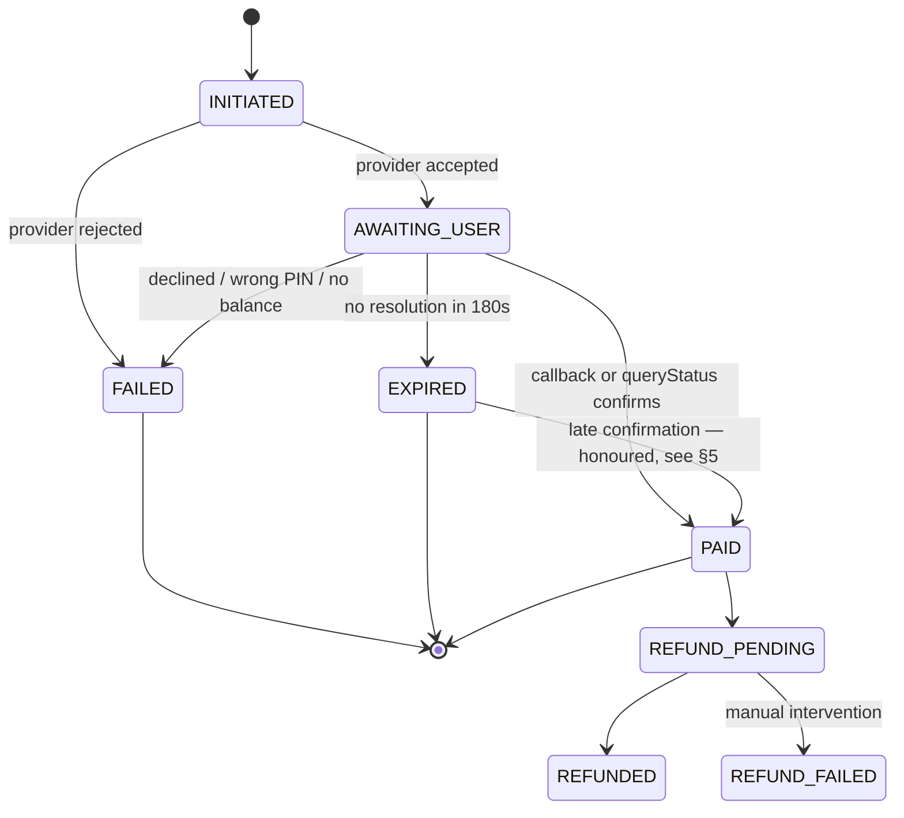
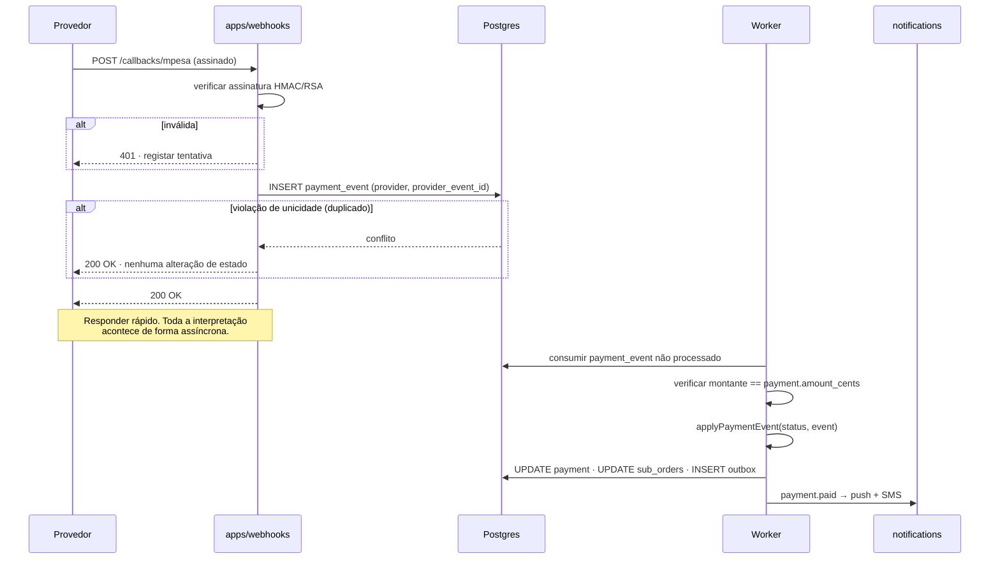
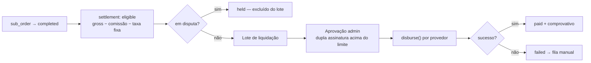

# 04 · Payments Architecture

Phase 2 · Architecture | Status: awaiting sign-off

The highest-risk module in the system, and the one blocked on a business relationship you must
secure (OQ-7, OQ-8). This document specifies the abstraction, the mock that makes it testable today,
and the exact runbook for swapping in production credentials.

---

## 1. The constraint, stated plainly

**M-Pesa and e-Mola have no self-service public API.** There is no developer portal where anyone can
register and receive sandbox keys. Access requires:

- a registered Mozambican business (Alvará + NUIT),
- a merchant relationship with Vodacom Moçambique or Movitel,
- KYB review and a signed merchant agreement,
- an issued merchant/short code,
- credentials released only after approval.

**I cannot obtain these.** Realistic lead time is 4–12 weeks, and it is the longest pole in the
project — which is why OQ-7 and OQ-8 asked you to start immediately, before Phase 3 code exists.

This is not a blocker on building. It is a blocker on *going live*. The architecture below is
designed so the entire checkout experience — including the asynchronous push, the callback, the
reconciliation, the failure paths, and the refunds — is fully built and fully tested against a mock
that reproduces the real protocol. The production swap is a configuration change plus credentials,
not a rewrite.

## 2. Provider interface

**D-22.** Every rail implements one interface. COD is a provider too — treating it as a special case
would fork the checkout state machine, and a forked state machine is where money gets lost.

```typescript
// apps/api/src/modules/payments/providers/payment-provider.interface.ts

export interface PaymentProvider {
  readonly id: ProviderId;                  // 'mpesa' | 'emola' | 'mkesh' | 'cod'
  readonly capabilities: ProviderCapabilities;

  /** Initiate a push/USSD "request to pay". Returns immediately; the user approves on their handset. */
  requestPayment(req: PaymentRequest): Promise<PaymentRequestResult>;

  /** Verify and normalise an inbound webhook. MUST be pure — no side effects, no DB writes. */
  parseCallback(raw: RawCallback): CallbackParseResult;

  /** Authoritative status query. The reconciliation path when a webhook never arrives. */
  queryStatus(providerTxId: string): Promise<ProviderStatus>;

  /** Refund a settled payment, full or partial. */
  refund(req: RefundRequest): Promise<RefundResult>;

  /** Disburse to a vendor payout account (settlement). Not all providers support this. */
  disburse?(req: DisbursementRequest): Promise<DisbursementResult>;
}

export interface ProviderCapabilities {
  supportsRefund: boolean;
  supportsPartialRefund: boolean;
  supportsDisbursement: boolean;
  requiresUserApproval: boolean;      // false for COD
  approvalTimeoutSeconds: number;     // 180 for wallets
}

export interface PaymentRequest {
  paymentId: string;                  // ours
  idempotencyKey: string;
  amountCents: Cents;          // branded integer centavos — see D-24, not bigint
  currency: 'MZN';
  payerMsisdn: string;                // E.164
  reference: string;                  // shown on the payer's SMS receipt
  description: string;
}

export type PaymentRequestResult =
  | { outcome: 'accepted'; providerTxId: string; expiresAt: Date }
  | { outcome: 'rejected'; code: FailureCode; message: string; retryable: boolean };

export type CallbackParseResult =
  | { valid: false; reason: 'bad_signature' | 'malformed' | 'unknown_provider' }
  | {
      valid: true;
      providerEventId: string;        // for the idempotency constraint
      providerTxId: string;
      ourReference: string;
      status: 'paid' | 'failed' | 'cancelled';
      code?: FailureCode;
      amountCents: Cents;             // verified against our record before acceptance
      occurredAt: Date;
    };

export type FailureCode =
  | 'insufficient_balance' | 'wrong_pin' | 'user_cancelled'
  | 'timeout' | 'provider_unavailable' | 'invalid_msisdn'
  | 'limit_exceeded' | 'unknown';
```

`parseCallback` being **pure** is deliberate. It is the only code that touches an unauthenticated
external payload, so keeping it free of side effects means signature verification and persistence
cannot be accidentally reordered by a future change.

### Registry — the one place the swap happens

```typescript
// apps/api/src/modules/payments/registry.ts

export function buildProviderRegistry(config: PaymentsConfig): Map<ProviderId, PaymentProvider> {
  const useMocks = config.mode === 'mock';        // PAYMENTS_MODE env var
  return new Map<ProviderId, PaymentProvider>([
    ['mpesa', useMocks ? new MockMpesaProvider(config.mock) : new MpesaProvider(config.mpesa)],
    ['emola', useMocks ? new MockEmolaProvider(config.mock) : new EmolaProvider(config.emola)],
    ['cod',   new CodProvider()],                 // no external dependency, identical in every env
  ]);
}
```

**This function is the entire production swap.** No checkout code, no order code, no client code
changes when real credentials arrive.

## 3. Payment state machine

Single source of truth in `packages/shared/src/state-machines/payment.ts`, so web, mobile, and API
all reason about payment state identically. Exhaustively unit-tested — every state × every event.



Transitions are applied through a single guarded function. There is no code path that writes
`payment.status` directly:

```typescript
export function applyPaymentEvent(
  current: PaymentStatus,
  event: PaymentEvent,
): TransitionResult {
  const allowed = PAYMENT_TRANSITIONS[current];
  if (!allowed.includes(event.type)) {
    // Not an error — late/duplicate callbacks are normal and must be inert.
    return { changed: false, reason: 'illegal_transition', current };
  }
  return { changed: true, next: TRANSITION_TARGET[current][event.type] };
}
```

An illegal transition is logged and ignored, not thrown. A duplicate `paid` callback arriving after
we already recorded `paid` is an entirely normal occurrence, and treating it as an error would page
someone at 3am for correct behaviour.

## 4. The callback path



Five defences, each against a real failure we expect:

1. **Signature verification before anything else.** An unsigned or badly signed callback never
   reaches business logic.
2. **`UNIQUE (provider, provider_event_id)`** makes duplicate delivery a database no-op rather than
   a thing application code has to remember to check.
3. **Amount verification.** A callback claiming an amount that differs from our record is rejected
   and alerted on. We do not trust an external payload to tell us what we charged.
4. **Fast 200.** Providers time out and retry aggressively. We acknowledge receipt and interpret
   asynchronously — a slow webhook handler causes retry storms.
5. **Raw payload persisted verbatim.** When something goes wrong months later, the argument is
   settled by what they actually sent, not by our interpretation of it.

## 5. Reconciliation — why the webhook is never load-bearing

A scheduled worker sweeps payments the webhook has not resolved. This is the difference between a
system that mostly works and one that is correct.

| Job | Schedule | Action |
|---|---|---|
| `payment.reconcile` | 30s, 60s, 180s after initiation, then every 5 min for 1h | `queryStatus()` against the provider; apply the result |
| `payment.expire` | Every minute | `AWAITING_USER` past `expires_at` → `EXPIRED` |
| `payment.late-sweep` | Hourly, for 72h after expiry | Catches late approvals — **an expired payment that the provider reports as paid is honoured**, the order is reinstated, and the buyer is notified |
| `payment.orphan-scan` | Daily | Provider transactions with no matching local payment → operations queue |
| `settlement.reconcile` | Daily | Disbursements vs. provider statements |

**`payment.late-sweep` is the job that protects the buyer.** Someone approves on their handset after
our 3-minute window closed; the money leaves their wallet; our UI said "expired". Without this job
that is a debited customer with no order — the single worst outcome the system can produce, and the
one that generates the story that spreads. `EXPIRED → PAID` exists in the state machine specifically
for it.

## 6. The mock provider

`MockMpesaProvider` and `MockEmolaProvider` reproduce the real protocol shape, not a stub that
returns success:

- `requestPayment` returns `202 accepted` with a synthetic `providerTxId`, then schedules a callback
  after a **configurable random delay of 5–90 seconds** — because a mock that resolves instantly
  lets a race condition ship.
- Outcomes are driven by the payer MSISDN, so every failure path is reachable in manual testing and
  deterministic in automated testing:

| Test MSISDN | Outcome |
|---|---|
| `+258840000001` | Paid after 8s |
| `+258840000002` | Paid after 75s — near the timeout boundary |
| `+258840000003` | `insufficient_balance` |
| `+258840000004` | `wrong_pin` |
| `+258840000005` | `user_cancelled` |
| `+258840000006` | Never responds → `EXPIRED`, then a **late** callback at 240s (exercises §5) |
| `+258840000007` | Duplicate callback delivered three times |
| `+258840000008` | Callback with a mismatched amount — must be rejected and alerted |
| `+258840000009` | Callback with an invalid signature — must be rejected |
| `+258840000010` | Provider returns 500 → circuit breaker |
| Any other | Paid after a random 5–20s |

- The callback is signed with a mock key using the same algorithm shape, so signature verification is
  genuinely exercised rather than bypassed in development.
- A development-only UI at `/dev/payments` lists pending mock payments with Approve / Decline
  buttons, standing in for the handset.

**This is the point of the whole design:** every end-to-end test in Phase 4 — browse → cart →
checkout → payment → tracking, including duplicate callbacks, late confirmations, and amount
mismatches — runs today, with no merchant agreement.

## 7. Production swap runbook

What you will have received from Vodacom or Movitel, and exactly what to do with it.

### Step 1 — Credentials into Secrets Manager

Never into a file, never into an environment variable in a task definition, never into git.

```
nhonga/prod/payments/mpesa
  ├── api_key
  ├── public_key                 (M-Pesa encrypts the session key with this)
  ├── service_provider_code      (your issued short code)
  ├── initiator_identifier
  ├── security_credential
  └── callback_shared_secret

nhonga/prod/payments/emola
  ├── client_id
  ├── client_secret
  ├── merchant_id
  └── callback_shared_secret
```

### Step 2 — Implement the real providers

> **Corrected during Phase 3 (D-26).** I originally wrote that these adapter files would exist
> from Phase 3 as near-complete implementations. They do not, deliberately. Endpoint paths, field
> names, and the signature algorithm are not public, and a plausible-looking wrong implementation
> is more dangerous than an explicit gap — it would look finished in review. `MpesaProvider` and
> `EmolaProvider` are therefore unwritten, and `buildProviderRegistry` **throws at startup** if
> `PAYMENTS_MODE=live`, so mock payments cannot reach production silently.

Write `apps/api/src/modules/payments/providers/mpesa/mpesa.provider.ts` and its e-Mola counterpart
against the integration specification you receive after signature, implementing the existing
`PaymentProvider` interface, then uncomment the two registrations in `registry.ts`.

**The contract test suite runs unchanged against the real provider in sandbox.** If the real
provider passes the same tests the mock passes, the integration is correct.

### Step 3 — Register callback URLs with the provider

```
https://webhooks.nhonga.co.mz/callbacks/mpesa
https://webhooks.nhonga.co.mz/callbacks/emola
```

Give them the NAT gateway's Elastic IP for allowlisting — several providers require a fixed source
IP, which is why the architecture pins one (architecture §6).

### Step 4 — Flip the flag

```
PAYMENTS_MODE=live      # was: mock
```

Staging first, with real sandbox credentials, for a full week of the Phase 4 test suite.

### Step 5 — Production verification

1. One real transaction of 1,00 MT to your own wallet, both rails.
2. Verify the callback arrives, the signature validates, and `payment_event` records it.
3. Verify a real refund end-to-end.
4. Verify settlement disbursement to a test vendor account.
5. Only then open registration to real buyers.

### What must not change

`packages/shared/src/state-machines/payment.ts`, the checkout endpoint, the order module, the mobile
and web clients. If any of them need changing when real credentials arrive, the abstraction was
wrong and that is a bug to fix before going live — not a thing to work around.

## 8. Settlement and disbursement



Commission is computed at **sub-order completion**, not at order time, using the `commission_rule`
in force at the time of the order — and the applied `commission_rule_id` is stored on the settlement
row. A vendor asking in 2028 why they were charged 12% on a 2026 order gets an exact answer.

**Payouts require admin approval**, with dual approval above a configurable threshold. An automated
payout pipeline with no human gate is how a compromised admin account empties the float.

## 9. Fraud and abuse controls

| Control | Where |
|---|---|
| Velocity limits — orders per user per hour, per device, per MSISDN | Checkout |
| Payment retry cap per order | Payment |
| First-order value cap for unverified new accounts | Checkout |
| Payout account changes require OTP + a 24h cooling-off before the next payout | Vendor |
| Payout holder name must match verified KYC identity | Onboarding |
| Mismatched callback amounts alert immediately | Webhook |
| Orphan provider transactions surface to operations daily | Reconciliation |
| Impossible-velocity detection — same MSISDN, distant districts | Risk worker |

## 10. Still open

| Item | Blocked on |
|---|---|
| Exact M-Pesa API field names and signature algorithm | OQ-7 — the integration PDF arrives after signature |
| e-Mola API shape | OQ-8 — documentation is thinner; the interface is built to absorb variation |
| Whether e-Mola supports programmatic disbursement | OQ-8. If not, settlements to Movitel vendors need a manual or bank path — **flag this in your first conversation with them**, as it materially affects vendor payout operations |
| Who bears the transaction fee | OQ-5 — the `payment_fee_cents` column exists either way |
| Settlement cadence — daily, weekly, on-demand | OQ-4 follow-up. Recommend weekly at launch, with manual early release for vendors in good standing |
| mKesh / Tmcel | Deferred. The provider slot exists; add when volume justifies a third merchant agreement |

---

**Next:** [05 · Security Architecture](05-security-architecture.md)
