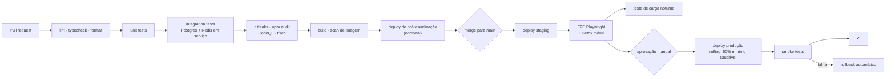

# 06 · Infrastructure & Delivery

Phase 2 · Architecture | Status: awaiting sign-off

AWS `af-south-1` (Cape Town), confirmed OQ-2. Everything in Terraform; no console changes.

---

## 1. Why af-south-1 (D-16)

Confirmed with you on 2026-09-15. The reasoning, recorded because it will be questioned when someone
compares the bill against a European region:

On 3G with ~400ms round-trip characteristics, **latency dominates perceived speed far more than
bandwidth**. A European region adds roughly 120ms to every request. That is invisible on one request
and painful across a session — and specifically painful on the checkout flow, which polls payment
status repeatedly while the buyer watches a timer and decides whether they have been robbed.

The premium over `eu-west-1` is roughly 15–20%. At launch scale that is on the order of $60–100 per
month. It buys a materially faster product in the exact flow where slowness costs conversions and
trust.

Terraform keeps the region and provider replaceable at bounded cost if that calculus changes.

## 2. Environments

| Environment | Purpose | Data | Payments |
|---|---|---|---|
| `local` | Development | Docker Compose, seeded | Mock |
| `staging` | Integration, QA, load testing | Anonymised, production-shaped | Mock → provider sandbox once OQ-7/8 land |
| `production` | Live | Real | Live |

Staging is a scaled-down production, **not a different architecture** — same services, same
Terraform modules, different variable file. A staging environment that differs structurally tests
something other than what you ship.

Configuration is entirely environment-driven. There are no environment conditionals in application
code; `NODE_ENV` never gates business logic.

## 3. Terraform layout

```
infra/terraform/
├── modules/
│   ├── network/          VPC, subnets, NAT, security groups
│   ├── database/         RDS Postgres, parameter groups, backups
│   ├── cache/            ElastiCache Redis
│   ├── search/           OpenSearch domain
│   ├── ecs-service/      Reusable service module (api, web, webhooks, workers)
│   ├── cdn/              CloudFront, WAF, ACM
│   ├── storage/          S3 buckets, lifecycle, bucket policies
│   ├── secrets/          Secrets Manager, KMS keys
│   └── observability/    CloudWatch alarms, dashboards, log groups
├── envs/
│   ├── staging/
│   └── production/
└── bootstrap/            State bucket, DynamoDB lock table, OIDC roles
```

State in S3 with DynamoDB locking. Production applies require a plan reviewed in the pull request
and an approval — Terraform is never applied from a laptop.

## 4. CI/CD



**Gates that block a merge:** lint, typecheck, unit, integration, secret scan, high/critical
dependency vulnerabilities, IaC scan, and the OpenAPI drift check (generated types must match the
spec).

**Production deploys require manual approval.** Continuous deployment to production is not
appropriate for a system that moves other people's money before it has an operational track record.

## 5. Deployment strategy and rollback

Rolling deploys on ECS: `minimumHealthyPercent: 100`, `maximumPercent: 200`, so a new task set comes
up and passes health checks before any old task is drained. Circuit breaker enabled with automatic
rollback on failed deployment.

| Scenario | Rollback |
|---|---|
| Failed health check during deploy | Automatic — ECS circuit breaker reverts to the previous task definition |
| Bad release detected after deploy | `terraform apply` with the previous image tag, or ECS console rollback. **Target: under 5 minutes.** |
| Bad database migration | **Forward-fix only.** See below |
| Mobile app release | Staged rollout at 10% → 50% → 100% on Play Console; halt on crash-rate regression |

### Database rollback is deliberately not a thing

Migrations are forward-only. Rolling a schema backwards against a database that has already accepted
writes under the new schema loses data, and losing order or payment data is unrecoverable.

Instead, the two-phase rule from the data model (§8) makes rollback unnecessary: a migration only
ever *adds*. Application code is deployed to stop writing a column in one release, and the column is
dropped in a later one. So rolling back the application is always safe, because the previous version
runs correctly against the new schema.

**This is why migrations are reviewed more carefully than application code** — they are the one part
of a release that is not reversible.

## 6. Backups and disaster recovery

| Asset | Backup | Retention | RPO | RTO |
|---|---|---|---|---|
| RDS | Automated daily + 5-min PITR | 35 days | 5 min | 1 hour |
| RDS snapshots | Weekly, cross-region to `eu-west-1` | 90 days | 7 days | 4 hours |
| S3 | Versioning + cross-region replication | Indefinite | Minutes | Minutes |
| Redis | Daily snapshot | 7 days | 24h — **acceptable, contents are rebuildable** | Minutes |
| OpenSearch | Rebuildable from Postgres | — | — | 2 hours |
| Terraform state | S3 versioned + replicated | Indefinite | — | — |

Cross-region snapshots exist because a region-level failure with no off-region copy is an
unrecoverable business event, not an outage.

**Restore drills run quarterly**, restoring production snapshots into a scratch environment and
verifying the data. A backup that has never been restored is a hypothesis.

## 7. Cost estimate

Launch scale (A-10: ~1,000 orders/day). Monthly, USD, `af-south-1`.

| Component | Spec | Est. |
|---|---|---|
| ECS Fargate — api | 2–8 × 0.5 vCPU / 1GB | $70–180 |
| ECS Fargate — web | 2–6 × 0.5 vCPU / 1GB | $60–150 |
| ECS Fargate — webhooks | 2 × 0.25 vCPU / 0.5GB | $18 |
| ECS Fargate — workers | 2–6 × 0.5 vCPU / 1GB | $60–140 |
| RDS Postgres | `db.t4g.medium` Multi-AZ, 100GB gp3 | $130 |
| ElastiCache Redis | `cache.t4g.micro` × 2 | $32 |
| OpenSearch | `t3.small.search` × 2 | $75 |
| S3 + CloudFront | ~500GB transfer | $45–90 |
| NAT Gateway | | $38 |
| ALB | | $22 |
| Secrets Manager, KMS, CloudWatch | | $30 |
| **AWS subtotal** | | **$580–905** |
| Sentry (team) | | $26 |
| **SMS — see note** | ~15,000/month | **$150–450** |
| **Total** | | **~$756–1,381** |

**SMS is the cost line to watch.** It scales with OTP volume, which scales with *login attempts*
rather than with orders — and it is the line an attacker can inflate directly. The daily spend cap
in the security architecture (§3) is a cost control as much as a security control. Model it at
2–3× your order volume, not 1×.

Reserved capacity and Savings Plans are worth revisiting after three months of real usage data, not
before.

## 8. Monitoring and alerting

Infrastructure alarms (CPU, memory, disk, connection count) page during business hours.

**These page 24/7**, because each one means money is at risk right now:

| Alarm | Threshold |
|---|---|
| Payment success rate | < 85% over 15 min |
| Payments stuck in `awaiting_user` | any > 15 min |
| Webhook endpoint 5xx | > 1% over 5 min |
| Reconciliation job failure | any |
| Settlement batch failure | any |
| Outbox backlog | > 1,000 unpublished |
| Checkout error rate | > 5% over 10 min |
| RDS failover | any |
| OTP send rate | > hourly pro-rata of the daily budget |

Dashboards: business (GMV, orders, payment success by provider, conversion), technical (latency,
errors, saturation), and cost.

## 9. Store submission checklist

Prepared now because Apple organisation verification alone can take weeks (OQ-14) and it sits on the
critical path to launch.

### Both stores
- [ ] Privacy policy and terms of service, published, PT + EN
- [ ] Support contact reachable in Portuguese
- [ ] Account deletion available **in-app** — an Apple requirement and a Google requirement
- [ ] Screenshots in Portuguese, on real device sizes
- [ ] Age rating questionnaire
- [ ] No placeholder content anywhere in the reviewed build

### Google Play
- [ ] Play Console account (OQ-14)
- [ ] Data safety form — collection, sharing, and retention declared per data type
- [ ] Target API level current
- [ ] AAB signed via Play App Signing
- [ ] Permissions justified: `CAMERA` (product photos, KYC), `POST_NOTIFICATIONS`,
      `ACCESS_FINE_LOCATION` (optional address capture — must be declared as optional)
- [ ] `RECEIVE_SMS` **not requested** — SMS Retriever API needs no permission, and requesting SMS
      access triggers a Play policy review that we do not need to enter
- [ ] Financial features declaration if required by Play policy for marketplace payments

### Apple App Store
- [ ] Developer Program organisation account + D-U-N-S (OQ-14 — start early)
- [ ] Privacy nutrition labels
- [ ] App Tracking Transparency — not needed, we do no cross-app tracking
- [ ] **Guideline 3.1.1 note:** physical goods and services are explicitly exempt from in-app
      purchase. Prepare a clear reviewer note stating the app sells physical goods delivered in
      Mozambique, as this is a common source of incorrect rejection for marketplaces
- [ ] Reviewer demo account with seeded orders across every state, plus mock-payment test MSISDNs
- [ ] Export compliance — standard TLS exemption
- [ ] Sign in with Apple **not required**: we offer no third-party social login, only our own phone
      OTP, so the requirement does not attach

## 10. Phase 3 prerequisites

Blocking the build phase on this machine:

- [ ] **Git** — not installed. Hard prerequisite for version control
- [ ] **Node.js LTS ≥ 20** — not installed
- [ ] **pnpm** ≥ 9
- [ ] **Docker Desktop** — for local Postgres, Redis, OpenSearch
- [ ] GitHub repository + organisation
- [ ] AWS account with OIDC configured for GitHub Actions
- [ ] Domain name and ACM certificates

---

## Phase 2 complete

| Document | |
|---|---|
| [00 · Stack & Rationale](00-stack-rationale.md) | Every technology choice, justified and with rejections recorded |
| [01 · System Architecture](01-system-architecture.md) | Context, modules, request paths, caching, failure modes |
| [02 · Data Model](02-data-model.md) | ERD, core DDL, snapshots, audit, retention |
| [03 · API Contract](03-api-contract.md) | Conventions + [`openapi.yaml`](../../apps/api/openapi.yaml) |
| [04 · Payments Architecture](04-payments-architecture.md) | Provider interface, mock, **production swap runbook** |
| [05 · Security Architecture](05-security-architecture.md) | OWASP coverage, threat model, regulatory flags |
| 06 · Infrastructure & Delivery | This document |

**Awaiting sign-off before Phase 3 (Build).**

Two things need your action regardless of sign-off:

1. **Start the Vodacom and Movitel merchant conversations** (OQ-7, OQ-8) if you have not. At 4–12
   weeks they remain the longest pole, and the build cannot become a launch without them.
2. **Take the payments licensing question to Mozambican counsel** (security §9, row 2). Whether
   operating as merchant of record requires a Banco de Moçambique licence is the highest-consequence
   open question in the project, and an answer of "yes" changes the business model rather than the
   code.
